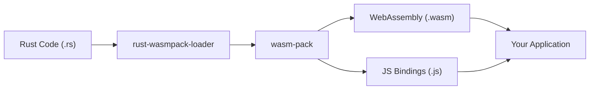

# Overview

## What is rust-wasmpack-loader?

**rust-wasmpack-loader** is a native WebAssembly (WASM) loader that allows you to seamlessly integrate Rust code into your JavaScript and TypeScript projects by just importing `.rs` files inside other code.

## How It Works

The loader automatically:

1. **Detects** `.rs` files in your project
2. **Finds** the corresponding `Cargo.toml` configuration
3. **Compiles** Rust code to WebAssembly using `wasm-pack`
4. **Generates** JavaScript bindings with `wasm-bindgen`
5. **Integrates** the compiled WASM module into your bundle

## Architecture

## Key Benefits
- **Direct imports** - Use `.rs` files like any other import module
- **Hot reload support** during development
- **TypeScript integration** with generated type definitions
- **Webpack 5+** support with explicit targets (web, node)
- **Bun runtime** compatibility for modern JavaScript environments

## Use Cases

### Ideal For:
- **Mathematical computations** (cryptography, image processing, algorithms)
- **Huge data processing** (parsing, transformation, validation)
- **Game engines** and graphics programming
- **Performance-critical libraries**
- **Legacy C/C++ code migration** to the web

### Examples:
- Image filters and manipulation
- Cryptocurrency mining/validation *(please, don't do this at least inside browsers)*
- Scientific simulations
- Audio/video processing
- Machine learning inference
- Compression algorithms

## Supported Targets

| Target       | Webpack           | Bun |
|--------------|-------------------|-----|
| `web`        | ✅                 | ❌   |
| `node`       | ✅                 | ✅   |
| `node-async` | ✅                 | ✅   |
| `electron`   | ⚠️ *(not tested)* | ❌   |

## Comparison with Alternatives

### Legend:
- ✅ **Full support** - Feature works out of the box
- ⚠️ **Partial support** - Feature works with additional configuration
- 🤚 **manual setup** - Feature requires manual steps to enable
- ❌ **No support** - Feature is not available
- 🟢 **Good** - Excellent experience
- 🟡 **Medium** - Acceptable with some effort
- 🔴 **Poor** - Significant challenges

| Feature                       | rust-wasmpack-loader | Manual wasm-pack | @wasm-tool/wasm-pack-plugin | vite-plugin-wasm | Rollup WASM | esbuild WASM | Raw WASM imports |
|-------------------------------|----------------------|------------------|-----------------------------|------------------|-------------|--------------|------------------|
| **Direct .rs imports**        | ✅                    | ❌                | ❌                           | ❌                | ❌           | ❌            | ❌                |
| **Auto Cargo.toml detection** | ✅                    | ❌                | 🤚                          | ❌                | ❌           | ❌            | ❌                |
| **Hot reload support**        | ✅                    | ❌                | ✅                           | ✅                | ⚠️          | ✅            | ❌                |
| **Bun runtime support**       | ✅                    | 🤚               | ❌                           | ❌                | ❌           | 🤚           | 🤚               |
| **Webpack integration**       | ✅                    | ❌                | ✅                           | ❌                | ❌           | ❌            | ⚠️               |
| **Vite/Rollup integration**   | ❌                    | ❌                | ❌                           | ✅                | ✅           | ❌            | ⚠️               |
| **esbuild integration**       | ❌                    | ❌                | ❌                           | ❌                | ❌           | ✅            | ⚠️               |
| **TypeScript bindings**       | ✅                    | ✅                | ✅                           | ✅                | ✅           | ✅            | ❌                |
| **Zero configuration**        | ✅                    | ❌                | ❌                           | ❌                | ❌           | ❌            | ❌                |
| **Async WASM loading**        | ✅                    | ✅                | ✅                           | ✅                | ✅           | ✅            | ✅                |
| **Bundle size optimization**  | ✅                    | ⚠️               | ⚠️                          | ✅                | ✅           | ✅            | ⚠️               |
| **Node.js target support**    | ✅                    | ✅                | ✅                           | ⚠️               | ✅           | ✅            | ✅                |
| **Web target support**        | ✅                    | ✅                | ✅                           | ✅                | ✅           | ✅            | ✅                |
| **Learning curve**            | 🟢 Easy              | 🔴 Hard          | 🟡 Medium                   | 🟡 Medium        | 🟡 Medium   | 🟡 Medium    | 🔴 Hard          |
| **Maintenance status**        | 🟢 Active            | 🟢 Active        | 🟡 Limited                  | 🟢 Active        | 🟢 Active   | 🟢 Active    | N/A              |

### Key Differentiators:

**rust-wasmpack-loader** stands out by:
- Being the only loader to support **direct `.rs` file imports** without build configuration
- Offering **native Bun runtime support** (unique in the ecosystem)
- Providing **automatic Cargo.toml discovery** up the directory tree
- Requiring **zero configuration** for basic usage
- Supporting both **Webpack and Bun** in a single package

**Alternative approaches:**
- **Manual wasm-pack**: Requires separate build steps and manual integration
- **@wasm-tool/wasm-pack-plugin**: More mature, Webpack-only, less automated and requires explicit configuration
- **vite-plugin-wasm**: Vite-specific, different ecosystem
- **Rollup/esbuild WASM**: Require pre-compiled WASM files
- **Raw WASM imports**: No build automation, manual TypeScript bindings