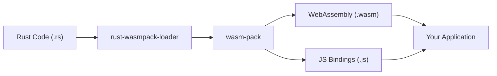

# Overview

## What is rust-wasmpack-loader?

rust-wasmpack-loader is a WebAssembly loader that lets you import `.rs` files directly in JavaScript and TypeScript. You import a Rust file the same way you import any module, and the loader compiles it to WebAssembly behind the scenes.

## How it works

When you import a `.rs` file, the loader:

1. Detects the `.rs` file in your project
2. Finds the nearest `Cargo.toml`
3. Compiles the Rust code to WebAssembly with `wasm-pack`
4. Generates JavaScript bindings with `wasm-bindgen`
5. Wires the compiled module into your bundle

## Architecture

```mermaid
graph LR
    A["Rust Code (.rs)"] --> B[rust-wasmpack-loader]
    B --> C[wasm-pack]
    C --> D["WebAssembly (.wasm)"]
    C --> E["JS Bindings (.js)"]
    D --> F[Your Application]
    E --> F
```

## Key benefits

- Import `.rs` files like any other module, with no separate build step to wire up
- Hot reload during development
- TypeScript integration through generated type definitions
- Webpack 5+ with explicit targets (web, node)
- Rspack through the same Webpack-compatible loader
- Bun runtime support
- esbuild plugin for bundling on Node.js or the browser
- Rollup plugin for Rollup-based pipelines
- Vite plugin that produces SSR (`node`) and client (`web`) output from a single `.rs` import
- Next.js helper (`withRustWasm`) so one `.rs` file works from Server Components, Client Components, and Edge routes (App Router)

## Use cases

The loader fits work where Rust earns its keep:

- Mathematical computation (cryptography, image processing, algorithms)
- Large-scale data processing (parsing, transformation, validation)
- Game engines and graphics programming
- Performance-critical libraries
- Migrating existing C/C++ code to the web

Concrete examples:

- Image filters and manipulation
- Cryptocurrency mining or validation *(please don't do this in a browser)*
- Scientific simulation
- Audio and video processing
- Machine learning inference
- Compression algorithms

## Supported targets

| Target       | Webpack           | Rspack            | Bun | esbuild | Rollup | Vite | Next.js |
|--------------|-------------------|-------------------|-----|---------|--------|------|---------|
| `web`        | ✅                 | ✅                 | ❌   | ✅       | ✅      | ✅    | ✅       |
| `node`       | ✅                 | ✅                 | ✅   | ✅       | ✅      | ✅    | ✅       |
| `node-async` | ✅                 | ✅                 | ✅   | ❌       | ❌      | ❌    | ❌       |
| `electron`   | ✅                 | ✅                 | ❌   | ❌       | ❌      | ❌    | ❌       |

Rspack reuses the Webpack loader context, so the loader works with it through the same configuration.

Electron's webpack targets map onto the same two strategies: `electron-main` and `electron-preload` use the `node`
strategy, `electron-renderer` uses `web`, and both inline the wasm bytes. webpack normalizes versioned targets such as
`electron20-main` down to these names before the loader sees them, and Rspack resolves them the same way, so the loader
works under both. See the [Electron example](../examples/electron) for the two-config setup.

Next.js uses the loader through the `withRustWasm` helper: the server build runs `node`, the client build runs `web`, and
both inline the wasm bytes. Edge routes work too, through a separate `module` delivery that ships the wasm as a
pre-compiled `WebAssembly.Module` (the one form the Edge runtime can instantiate). The helper wires all of this into both
bundlers, so the wrapped config builds under Turbopack (`next build`, the Next.js 16 default) and webpack (`next build
--webpack`) alike. The asset-emitting modes (`web.asyncLoading`, `node.bundle: false`) still need `emitFile`, which
Turbopack does not expose, so the helper leaves them out of the Next path.

## Comparison with alternatives

Legend:

- ✅ Full support - works out of the box
- ⚠️ Partial support - works with extra configuration
- 🤚 Manual setup - needs manual steps to enable
- ❌ No support - not available
- 🟢 Good - smooth experience
- 🟡 Medium - workable with some effort
- 🔴 Poor - significant friction

| Feature                       | rust-wasmpack-loader | Manual wasm-pack | @wasm-tool/wasm-pack-plugin | vite-plugin-wasm | Rollup WASM | esbuild WASM | Raw WASM imports |
|-------------------------------|----------------------|------------------|-----------------------------|------------------|-------------|--------------|------------------|
| **Direct .rs imports**        | ✅                    | ❌                | ❌                           | ❌                | ❌           | ❌            | ❌                |
| **Auto Cargo.toml detection** | ✅                    | ❌                | 🤚                          | ❌                | ❌           | ❌            | ❌                |
| **Hot reload support**        | ✅                    | ❌                | ✅                           | ✅                | ⚠️          | ✅            | ❌                |
| **Bun runtime support**       | ✅                    | 🤚               | ❌                           | ❌                | ❌           | 🤚           | 🤚               |
| **Webpack integration**       | ✅                    | ❌                | ✅                           | ❌                | ❌           | ❌            | ⚠️               |
| **Vite/Rollup integration**   | ✅                    | ❌                | ❌                           | ✅                | ✅           | ❌            | ⚠️               |
| **esbuild integration**       | ✅                    | ❌                | ❌                           | ❌                | ❌           | ✅            | ⚠️               |
| **TypeScript bindings**       | ✅                    | ✅                | ✅                           | ✅                | ✅           | ✅            | ❌                |
| **Zero configuration**        | ✅                    | ❌                | ❌                           | ❌                | ❌           | ❌            | ❌                |
| **Async WASM loading**        | ✅                    | ✅                | ✅                           | ✅                | ✅           | ✅            | ✅                |
| **Bundle size optimization**  | ✅                    | ⚠️               | ⚠️                          | ✅                | ✅           | ✅            | ⚠️               |
| **Node.js target support**    | ✅                    | ✅                | ✅                           | ⚠️               | ✅           | ✅            | ✅                |
| **Web target support**        | ✅                    | ✅                | ✅                           | ✅                | ✅           | ✅            | ✅                |
| **Learning curve**            | 🟢 Easy              | 🔴 Hard          | 🟡 Medium                   | 🟡 Medium        | 🟡 Medium   | 🟡 Medium    | 🔴 Hard          |
| **Maintenance status**        | 🟢 Active            | 🟢 Active        | 🟡 Limited                  | 🟢 Active        | 🟢 Active   | 🟢 Active    | N/A              |

What sets rust-wasmpack-loader apart:

- The only loader with direct `.rs` file imports and no build configuration
- Native Bun runtime support, which no other option in this list provides
- Automatic `Cargo.toml` discovery up the directory tree
- Zero configuration for basic usage
- One package covering Webpack, Rspack, Bun, esbuild, Rollup, Vite, and Next.js
- The only one that compiles the same `.rs` import to SSR (`node`) and client (`web`) output in Vite automatically

How the alternatives compare:

- Manual wasm-pack: separate build steps and manual integration
- @wasm-tool/wasm-pack-plugin: more mature but Webpack-only, less automated, and needs explicit configuration
- vite-plugin-wasm: Vite-specific, a different ecosystem
- Rollup and esbuild WASM: expect pre-compiled WASM files
- Raw WASM imports: no build automation, and you write the TypeScript bindings yourself
